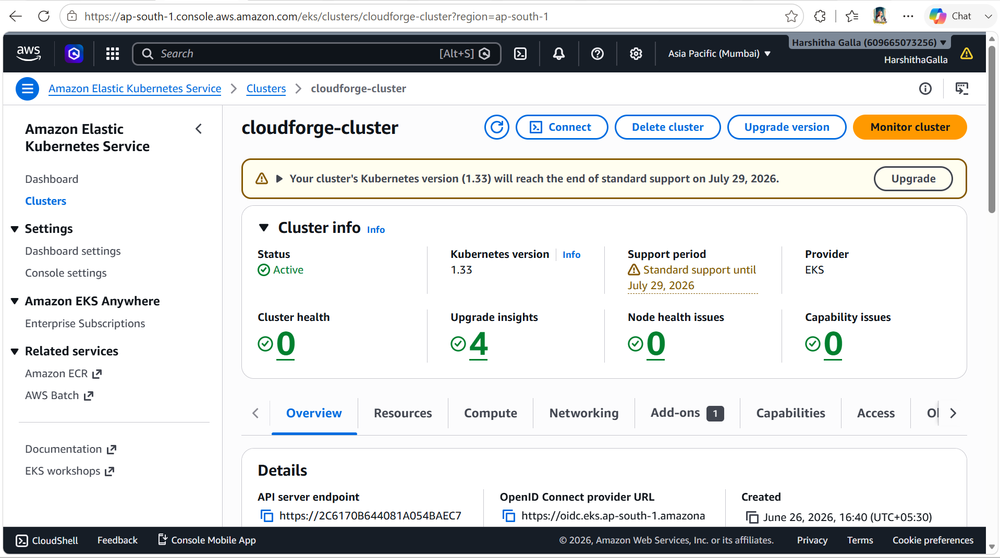
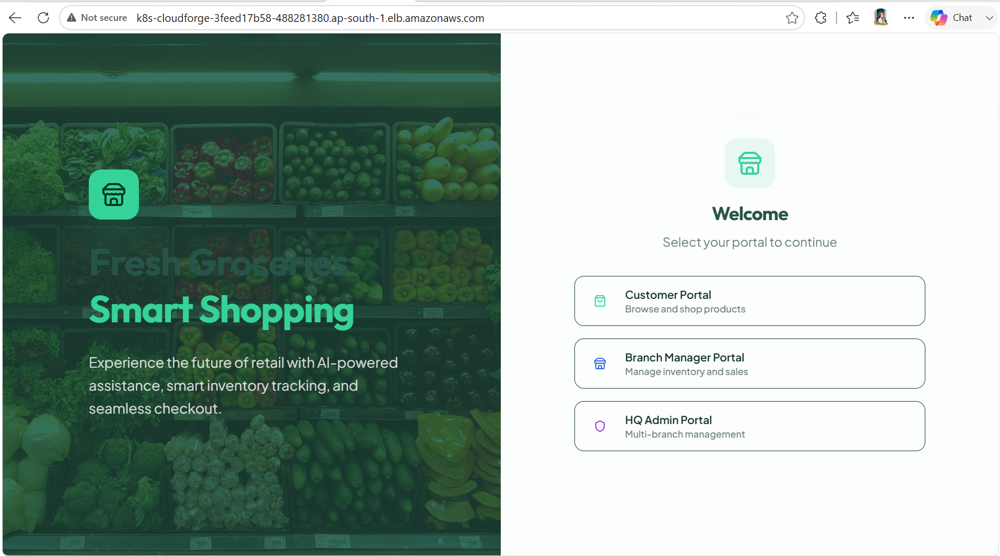
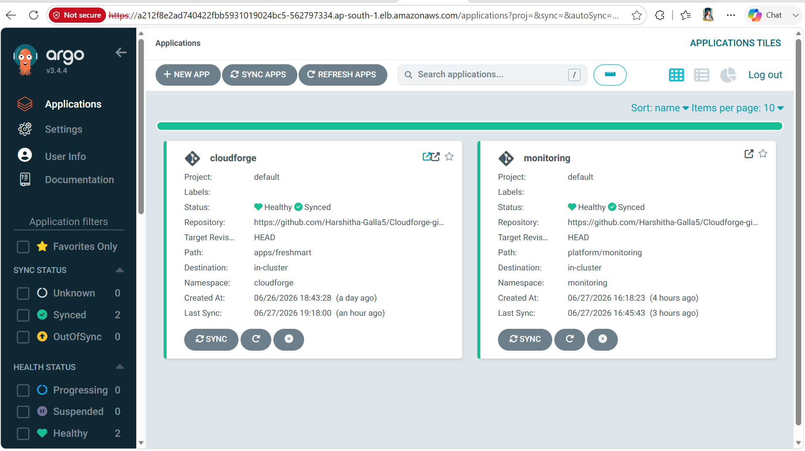

# Installation Guide

This document provides a complete guide for deploying the CloudForge Retail Platform on Amazon Web Services (AWS) using Amazon EKS, ArgoCD, Kubernetes, GitHub Actions, and the monitoring stack.

---

# Prerequisites

Before starting the deployment, ensure the following requirements are met.

## AWS

* AWS Account
* IAM User with Administrator Access (or equivalent permissions)
* AWS CLI configured
* Amazon EKS access

Verify AWS configuration:

```bash
aws sts get-caller-identity
```

---

## Local Machine

Install the following tools:

* Git
* Docker
* kubectl
* eksctl
* Helm
* AWS CLI

Verify installation:

```bash
git --version
docker --version
kubectl version
eksctl version
helm version
aws --version
```

---

# Clone the Repositories

## Application Repository

```bash
git clone https://github.com/Harshitha-Galla5/Cloudforge-retail-platform.git
```

---

## GitOps Repository

```bash
git clone https://github.com/Harshitha-Galla5/Cloudforge-gitops.git
```

---

# Create Amazon EKS Cluster

The cluster configuration is available inside:

```text
bootstrap/cluster.yaml
```

Create the cluster:

```bash
eksctl create cluster -f bootstrap/cluster.yaml
```

Verify the cluster:

```bash
kubectl get nodes
```

Expected output:

```text
NAME                                  STATUS   ROLES   AGE
ip-xxx.ap-south-1.compute.internal    Ready
```

---

# Create Amazon RDS Database

Create a PostgreSQL database.

Recommended configuration:

* Engine: PostgreSQL
* Public Access: Enabled (for development)
* Security Group: Allow PostgreSQL (5432)
* Database Name: smart_store

Update the application secret with the database connection string.

---

# Configure Kubernetes Secret

Create the application secret.

Example:

```bash
kubectl apply -f apps/freshmart/secret.yaml
```

For public repositories, use:

```text
secret-template.yaml
```

instead of storing real credentials.

---

# Deploy the Application

Navigate to the application manifests:

```text
apps/freshmart
```

Deploy:

```bash
kubectl apply -k apps/freshmart
```

Verify deployment:

```bash
kubectl get all -n cloudforge
```

---

# Install ArgoCD

Create the namespace:

```bash
kubectl create namespace argocd
```

Install ArgoCD:

```bash
kubectl apply -n argocd \
-f https://raw.githubusercontent.com/argoproj/argo-cd/stable/manifests/install.yaml
```

Verify installation:

```bash
kubectl get pods -n argocd
```

---

# Access ArgoCD

Forward the service:

```bash
kubectl port-forward svc/argocd-server \
-n argocd \
8080:443
```

Open:

```text
https://localhost:8080
```

Retrieve the initial admin password:

```bash
kubectl -n argocd \
get secret argocd-initial-admin-secret \
-o jsonpath="{.data.password}" \
| base64 -d
```

---

# Deploy Monitoring Stack

Navigate to:

```text
platform/monitoring
```

Deploy using ArgoCD or Helm depending on the deployment method.

Verify:

```bash
kubectl get pods -n monitoring
```

---

# Access Grafana

Port-forward Grafana:

```bash
kubectl port-forward svc/monitoring-grafana \
-n monitoring \
3000:80
```

Open:

```text
http://localhost:3000
```

---

# Verify Application

Check all resources:

```bash
kubectl get all -n cloudforge
```

Check ingress:

```bash
kubectl get ingress -n cloudforge
```

Open the generated AWS ALB DNS name in a browser.

The FreshMart application should load successfully.

---

# Verify Monitoring

Ensure all monitoring components are running.

```bash
kubectl get pods -n monitoring
```

Expected components:

* Prometheus
* Grafana
* Alertmanager
* Node Exporter
* kube-state-metrics

---

# Verify ArgoCD

```bash
kubectl get applications -n argocd
```

Expected:

```text
NAME          STATUS

cloudforge    Synced

monitoring    Synced
```

---

# Deployment Verification Checklist

Confirm the following:

* Amazon EKS cluster is running.
* Kubernetes nodes are Ready.
* FreshMart pods are Running.
* Service is available.
* ALB is provisioned.
* Application is accessible.
* ArgoCD reports Synced and Healthy.
* Prometheus is running.
* Grafana is accessible.
* Horizontal Pod Autoscaler is active.

---

# Screenshots

Add the following screenshots after deployment.

Amazon EKS




Application




ArgoCD




Grafana


---

# Cleanup

Delete the application:

```bash
kubectl delete -k apps/freshmart
```

Delete the monitoring stack:

```bash
kubectl delete application monitoring -n argocd
```

Delete the EKS cluster:

```bash
eksctl delete cluster \
--name cloudforge-cluster \
--region ap-south-1
```

Delete the RDS database from the AWS Console if it is no longer required.

---

# Next Steps

After successfully deploying the platform, continue with:

* Understanding the GitOps workflow
* Exploring Kubernetes resources
* Monitoring application metrics
* Scaling workloads using HPA
* Reviewing troubleshooting scenarios
