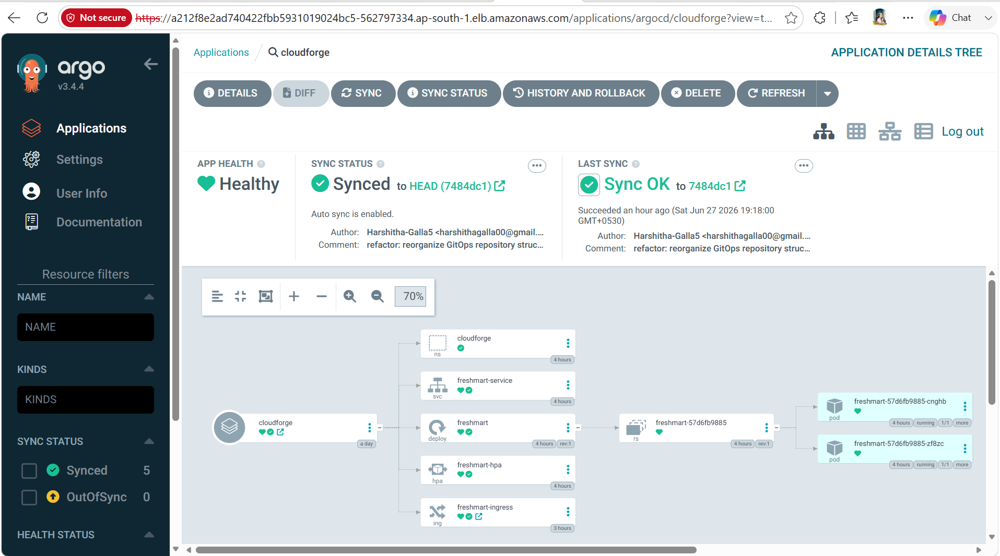
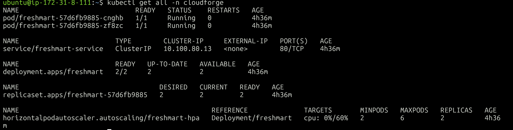

# GitOps Workflow

This document explains how CloudForge Retail Platform implements GitOps to automate Kubernetes deployments using GitHub Actions, Docker Hub, ArgoCD, and Amazon EKS.

---

# What is GitOps?

GitOps is an operational model where Git acts as the **single source of truth** for infrastructure and application deployment.

Instead of manually applying Kubernetes manifests using `kubectl`, every change is committed to Git. ArgoCD continuously watches the Git repository and synchronizes the Kubernetes cluster with the desired state.

This approach provides:

* Version-controlled infrastructure
* Automated deployments
* Rollback capability
* Deployment history
* Reduced manual intervention
* Improved reliability

---

# GitOps Architecture

> **Architecture Diagram Placeholder**


The deployment pipeline consists of two independent repositories:

* **Application Repository**
* **GitOps Repository**

This separation ensures that application development and infrastructure management remain independent while still enabling fully automated deployments.

---

# GitOps Workflow Overview

```text
Developer
     │
     ▼
Application Repository
     │
GitHub Actions
     │
Docker Image Build
     │
Docker Hub
     │
Update GitOps Repository
     │
Git Commit
     │
ArgoCD
     │
Amazon EKS
     │
Kubernetes Deployment
```

---

# Step 1 – Source Code Changes

A developer modifies the application source code inside the Application Repository.

Typical changes include:

* New features
* Bug fixes
* UI improvements
* API changes
* Dependency updates

After completing the changes, the developer pushes the code to GitHub.

---

# Step 2 – GitHub Actions Pipeline

A push to the main branch automatically triggers the GitHub Actions workflow.

The workflow performs the following tasks:

1. Checkout source code
2. Build Docker image
3. Tag the image
4. Push image to Docker Hub
5. Update the GitOps repository
6. Commit the updated image tag

This process eliminates manual image creation and deployment.

---

## Screenshot


---

# Step 3 – Docker Image

After a successful build, GitHub Actions publishes a new Docker image to Docker Hub.

Example:

```text
harshitha30galla/freshmart:v10
```

Using immutable image tags ensures that every deployment references a specific application version.

Benefits include:

* Version tracking
* Easy rollback
* Reproducible deployments

---

## Screenshot


---

# Step 4 – Updating the GitOps Repository

After publishing the Docker image, GitHub Actions updates the Kubernetes Deployment manifest inside the GitOps repository.

Example:

Before:

```yaml
image: harshitha30galla/freshmart:v1
```

After:

```yaml
image: harshitha30galla/freshmart:39702bc
```

This commit becomes the new desired state of the cluster.

---

# Step 5 – ArgoCD Synchronization

ArgoCD continuously monitors the GitOps repository.

When a new commit is detected, ArgoCD performs the following actions:

1. Fetch latest Git commit
2. Compare desired state with cluster state
3. Detect configuration drift
4. Synchronize Kubernetes resources
5. Perform rolling update

This process happens automatically without requiring manual deployment commands.

---

## Screenshot





---

# Step 6 – Kubernetes Rolling Update

After synchronization, Kubernetes updates the Deployment.

The Deployment controller performs a rolling update by:

* Creating new Pods
* Waiting for them to become Ready
* Gradually terminating old Pods

This minimizes downtime during application updates.

---

## Screenshot




---

# Continuous Delivery Pipeline

The complete deployment pipeline is illustrated below.

```text
Developer

↓

Git Push

↓

GitHub

↓

GitHub Actions

↓

Docker Build

↓

Docker Hub

↓

Update GitOps Repository

↓

ArgoCD

↓

Amazon EKS

↓

Rolling Deployment

↓

Application Updated
```

---

# Why Separate Repositories?

CloudForge uses two repositories.

## Application Repository

Responsibilities:

* Source code
* Dockerfile
* CI pipeline
* Docker image build

Repository:

Cloudforge-retail-platform

---

## GitOps Repository

Responsibilities:

* Kubernetes manifests
* Infrastructure configuration
* ArgoCD Applications
* Monitoring stack

Repository:

Cloudforge-gitops

---

This separation provides:

* Better security
* Clear ownership
* Easier auditing
* Cleaner version history
* Independent application and infrastructure changes

---

# Advantages of GitOps

CloudForge benefits from GitOps in several ways.

## Version Control

Every infrastructure change is stored in Git.

---

## Automatic Synchronization

No manual deployment commands are required after updating the GitOps repository.

---

## Rollback

Previous Git commits can be redeployed easily.

---

## Audit Trail

Every deployment is traceable through Git history.

---

## Declarative Infrastructure

The Kubernetes cluster always converges toward the desired state stored in Git.

---

# Best Practices Implemented

The project follows several GitOps best practices.

* Separate application and infrastructure repositories
* Immutable Docker image tags
* Declarative Kubernetes manifests
* Automatic synchronization
* Version-controlled deployments
* Kubernetes namespace isolation
* Monitoring platform managed independently

---

# Screenshots

Include the following screenshots.

GitHub Actions


Docker Hub


ArgoCD Dashboard


Application Tree


---

# Summary

CloudForge Retail Platform demonstrates a complete GitOps workflow where application changes automatically propagate from the Application Repository to the Kubernetes cluster without manual deployment.

The combination of GitHub Actions, Docker Hub, ArgoCD, and Amazon EKS enables a reliable, repeatable, and production-inspired deployment process.

---

