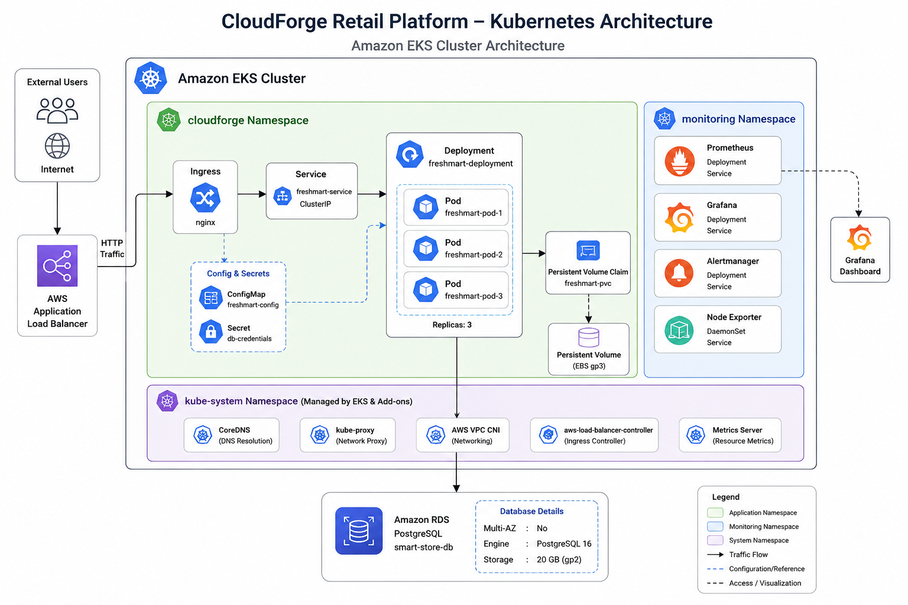
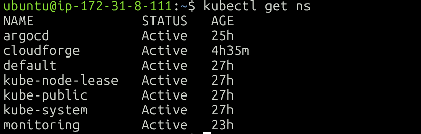
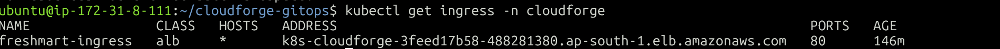

# Kubernetes Resources

This document explains every Kubernetes resource used in the CloudForge Retail Platform. It describes the purpose of each resource, how they interact, and why they are required for deploying a production-inspired application on Amazon EKS.

---

# Kubernetes Architecture

> **Architecture Diagram Placeholder**




The FreshMart application is deployed using native Kubernetes resources.

The deployment consists of:

* Namespace
* Deployment
* Pods
* Service
* Ingress
* Secret
* Horizontal Pod Autoscaler (HPA)

Together these resources provide application deployment, networking, configuration management, scalability, and high availability.

---

# Resource Overview

| Resource   | Purpose                    |
| ---------- | -------------------------- |
| Namespace  | Logical isolation          |
| Deployment | Manages Pods               |
| Pods       | Run application containers |
| Service    | Internal networking        |
| Ingress    | External access            |
| Secret     | Sensitive configuration    |
| HPA        | Automatic scaling          |

---

# Namespace

## Purpose

A Namespace logically separates Kubernetes resources inside a cluster.

CloudForge uses a dedicated namespace:

```text
cloudforge
```

This prevents application resources from mixing with monitoring or ArgoCD components.

Namespace isolation improves:

* Organization
* Security
* Resource management
* Easier troubleshooting

---

## Screenshot




---

# Deployment

## Purpose

A Deployment manages application Pods.

Instead of manually creating Pods, Kubernetes continuously ensures that the desired number of Pods remain available.

CloudForge Deployment manages:

* Replica count
* Rolling updates
* Pod replacement
* Self-healing

Example:

```text
Deployment

↓

ReplicaSet

↓

Pods
```

If a Pod crashes, Kubernetes automatically creates a replacement.

---

# Pods

## Purpose

Pods are the smallest deployable units in Kubernetes.

Each FreshMart Pod contains:

* Node.js Application
* Environment Variables
* Database Connection
* Application Container

The Deployment maintains multiple Pods for high availability.

Example:

```text
Pod 1

Pod 2
```

If one Pod fails, traffic is automatically routed to the remaining healthy Pod.

---

# Service

## Purpose

Pods are temporary.

Whenever Pods restart, their IP addresses change.

Instead of accessing Pods directly, Kubernetes uses a Service.

The Service provides:

* Stable IP Address
* Stable DNS Name
* Internal Load Balancing

Example:

```text
Service

↓

Pod 1

Pod 2
```

CloudForge uses a ClusterIP Service because external traffic is handled through an Ingress.

---

# Ingress

## Purpose

Ingress exposes the application to external users.

CloudForge uses the AWS Load Balancer Controller.

When the Ingress resource is created:

1. AWS provisions an Application Load Balancer (ALB).
2. The ALB receives internet traffic.
3. Traffic is forwarded to the Kubernetes Service.
4. The Service distributes traffic across Pods.

Request flow:

```text
User

↓

AWS ALB

↓

Ingress

↓

Service

↓

Pods
```

---

## Screenshot




---

# Secret

## Purpose

Sensitive information should never be hardcoded inside application images.

CloudForge stores runtime configuration inside Kubernetes Secrets.

Examples:

* Database URL
* API Keys

The Deployment loads these values using:

```yaml
envFrom:
  secretRef:
```

For security reasons, this repository contains a **secret-template.yaml** instead of real credentials.

---

# Horizontal Pod Autoscaler (HPA)

## Purpose

Traffic can increase unexpectedly.

Instead of manually scaling Pods, Kubernetes automatically adjusts the number of replicas.

CloudForge HPA monitors CPU utilization.

Example:

```text
CPU Usage > 60%

↓

Scale Out

↓

2 Pods

↓

4 Pods

↓

6 Pods
```

When traffic decreases:

```text
CPU Usage Low

↓

Scale In

↓

6 Pods

↓

3 Pods

↓

2 Pods
```

This improves:

* Performance
* Availability
* Resource utilization

---

# Request Flow

A client request follows this path:

```text
Browser

↓

Application Load Balancer

↓

Ingress

↓

Service

↓

FreshMart Pods

↓

Amazon RDS PostgreSQL
```

Step-by-step:

1. The user opens the application URL.
2. AWS ALB receives the request.
3. The Ingress forwards traffic to the Service.
4. The Service selects a healthy Pod.
5. The Pod processes the request.
6. If database access is required, the Pod connects to Amazon RDS.
7. The response is returned to the client.

---

# Self-Healing

One of Kubernetes' key features is self-healing.

If a Pod crashes:

```text
Pod Crashes

↓

Deployment Detects Failure

↓

ReplicaSet Creates New Pod

↓

Application Restored
```

No manual intervention is required.

---

# Rolling Updates

CloudForge uses Kubernetes Deployments to perform rolling updates.

During a deployment:

1. New Pods are created.
2. Health checks verify readiness.
3. Old Pods are terminated gradually.
4. Service availability is maintained.

This minimizes downtime during updates.

---

# Why These Resources?

Each resource has a specific responsibility.

| Resource   | Responsibility                 |
| ---------- | ------------------------------ |
| Namespace  | Logical isolation              |
| Deployment | Manage application lifecycle   |
| Pods       | Execute application containers |
| Service    | Stable networking              |
| Ingress    | External traffic routing       |
| Secret     | Secure configuration           |
| HPA        | Automatic scaling              |

Together these resources provide a complete deployment platform.

---

# Screenshots

Include the following screenshots:

Cluster 


Resources


Ingress


---

# Summary

The CloudForge Retail Platform uses core Kubernetes resources to provide a scalable, highly available, and production-inspired deployment.

By combining Deployments, Services, Ingress, Secrets, and Horizontal Pod Autoscaling, the platform delivers automated deployment, networking, secure configuration management, and dynamic scaling while following Kubernetes best practices.

---
