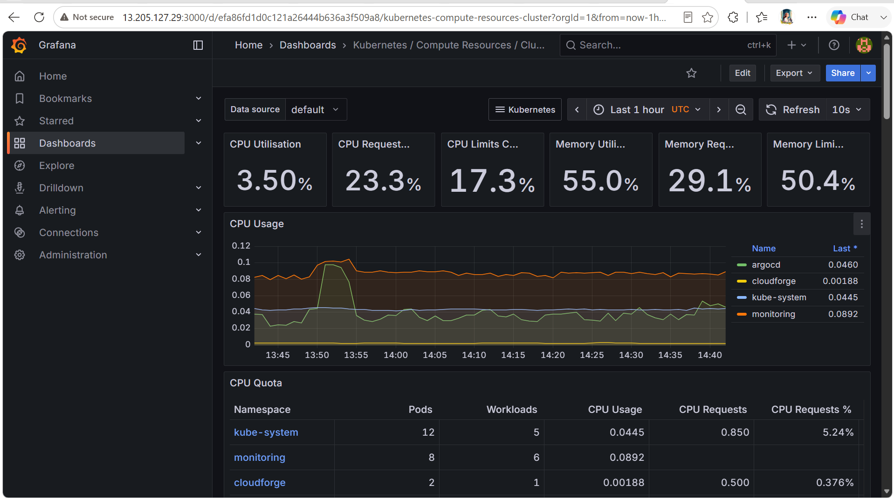
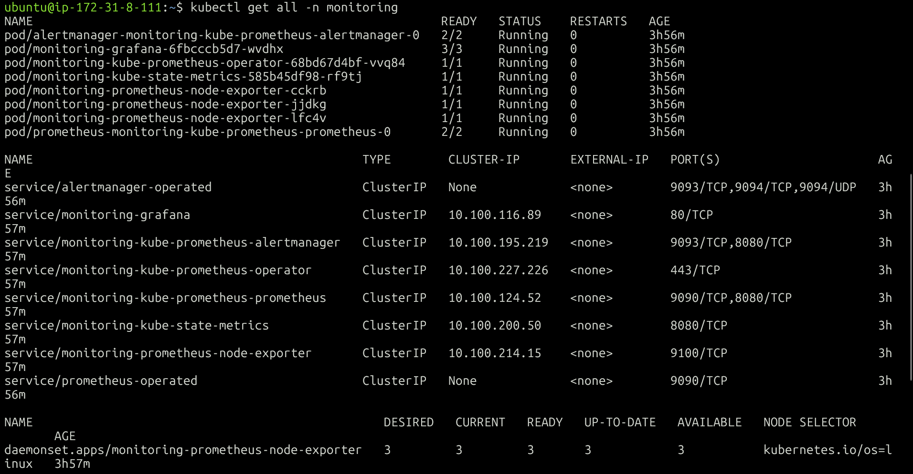
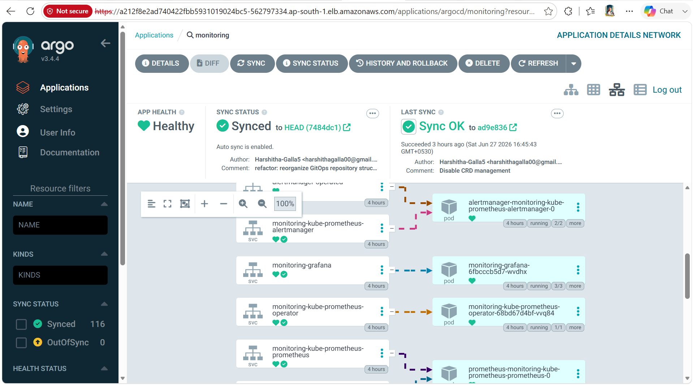

# Monitoring

This document explains how monitoring is implemented in the CloudForge Retail Platform using Prometheus, Grafana, Alertmanager, Node Exporter, kube-state-metrics, and Helm.

The monitoring stack provides real-time visibility into the Kubernetes cluster, application workloads, and infrastructure resources, helping identify issues before they impact application availability.

---

# Overview

CloudForge uses the **kube-prometheus-stack** Helm chart to deploy a complete monitoring platform on Amazon EKS.

Instead of installing each monitoring component individually, the Helm chart bundles all required services and configures them to work together.

The monitoring stack is managed through GitOps using ArgoCD, ensuring that monitoring infrastructure is version-controlled and automatically synchronized with the cluster.

---

# Monitoring Stack

The monitoring stack consists of the following components:

* Prometheus
* Grafana
* Alertmanager
* Node Exporter
* kube-state-metrics

Each component has a dedicated responsibility within the monitoring ecosystem.

---

# Monitoring Workflow

```text
Kubernetes Cluster

        │

        ▼

Node Exporter
kube-state-metrics

        │

        ▼

Prometheus

        │

        ▼

Grafana Dashboard

        │

        ▼

Cluster Administrator
```

Prometheus collects metrics from Kubernetes nodes and workloads. Grafana queries Prometheus to visualize these metrics through dashboards.

---

# Why Helm?

The monitoring stack is deployed using Helm because it simplifies the installation and management of complex Kubernetes applications.

Instead of manually creating dozens of Deployments, Services, ConfigMaps, and Custom Resource Definitions (CRDs), Helm packages them into a reusable chart.

Benefits include:

* Simplified installation
* Easy upgrades
* Version control
* Centralized configuration
* Consistent deployments

CloudForge uses the **kube-prometheus-stack** Helm chart maintained by the Prometheus Community.

---

# Monitoring Components

## Prometheus

Prometheus is responsible for collecting and storing time-series metrics from Kubernetes resources.

It periodically scrapes metrics from:

* Kubernetes API
* Node Exporter
* kube-state-metrics
* Application Pods
* Kubernetes Nodes

Prometheus stores these metrics in its internal time-series database, making them available for querying and visualization.

---

### Responsibilities

* Metric collection
* Metric storage
* Query execution
* Alert rule evaluation

---

# Grafana

Grafana provides dashboards for visualizing metrics collected by Prometheus.

It connects directly to Prometheus as a data source and displays cluster health, resource utilization, and workload performance.

CloudForge uses Grafana to monitor:

* CPU Usage
* Memory Usage
* Node Health
* Pod Status
* Cluster Metrics

---

### Screenshot




---

# Alertmanager

Alertmanager manages alerts generated by Prometheus.

Its responsibilities include:

* Alert grouping
* Alert routing
* Notification management
* Alert suppression

Although CloudForge currently focuses on dashboard monitoring, Alertmanager is deployed as part of the monitoring platform and can be extended to send notifications through email, Slack, or Microsoft Teams.

---

# Node Exporter

Node Exporter runs as a DaemonSet.

This ensures one instance is deployed on every Kubernetes node.

It collects operating system metrics such as:

* CPU Usage
* Memory Usage
* Disk Utilization
* Network Traffic
* File System Statistics

These metrics help monitor the health of worker nodes.

---

# kube-state-metrics

kube-state-metrics exposes Kubernetes object metrics.

Unlike Node Exporter, it focuses on Kubernetes resources rather than operating system metrics.

Examples include:

* Deployments
* ReplicaSets
* Pods
* Services
* StatefulSets
* DaemonSets

This allows Grafana dashboards to display Kubernetes-specific information.

---

# Monitoring Namespace

The monitoring platform is deployed in its own namespace.

```text
monitoring
```

This separates monitoring resources from application workloads and simplifies management.

---

### Screenshot




---

# Monitoring Stack Deployment

The monitoring platform is deployed using:

```text
platform/
└── monitoring/
```

Key files include:

```
Chart.yaml
values.yaml
application.yaml
```

### Chart.yaml

Defines the Helm chart and its dependency.

### values.yaml

Contains customized configuration such as:

* Grafana configuration
* Prometheus retention
* Persistent storage

### application.yaml

Defines the ArgoCD Application responsible for deploying the monitoring stack.

---

# Monitoring through GitOps

The monitoring platform is managed using ArgoCD.

Deployment workflow:

```text
Git Commit

↓

GitOps Repository

↓

ArgoCD

↓

Helm Chart

↓

Monitoring Stack

↓

Amazon EKS
```

This ensures monitoring infrastructure is automatically synchronized whenever configuration changes are committed.

---

### Screenshot





---

# Helm Configuration

CloudForge customizes the monitoring stack using the Helm values file.

Examples include:

* Grafana persistence
* Admin password
* Prometheus storage
* Metric retention

Using a centralized values file keeps the deployment clean and maintainable.

---

# Monitoring Verification

Verify monitoring resources:

```bash
kubectl get all -n monitoring
```

Verify Helm release:

```bash
helm list -n monitoring
```

Verify Prometheus:

```bash
kubectl get pods -n monitoring
```

---

# Best Practices

CloudForge follows several monitoring best practices:

* Dedicated monitoring namespace
* Helm-based deployment
* GitOps-managed monitoring
* Persistent Prometheus storage
* Persistent Grafana storage
* Declarative configuration using values.yaml

---

# Summary

The CloudForge Retail Platform implements a production-inspired monitoring solution using Prometheus, Grafana, Alertmanager, Node Exporter, and kube-state-metrics.

By managing the monitoring stack with Helm and ArgoCD, the project demonstrates how observability can be integrated into a Kubernetes platform using modern GitOps practices.

---

