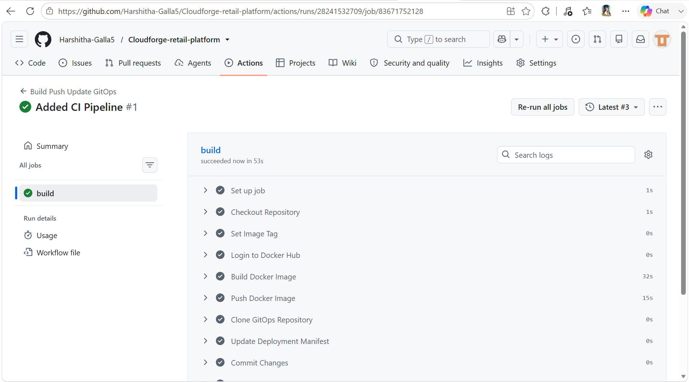
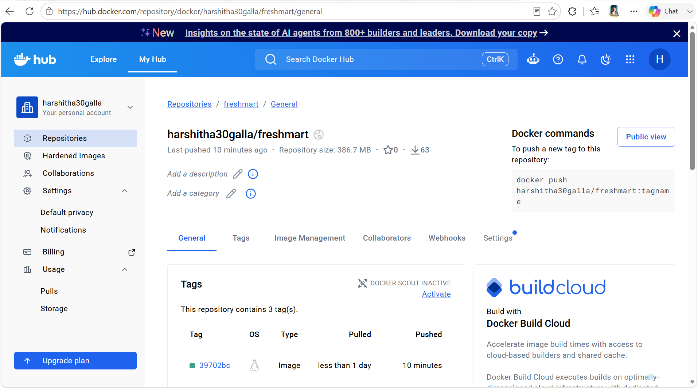

# Continuous Integration and Continuous Deployment (CI/CD)

This document explains the Continuous Integration (CI) pipeline implemented for the CloudForge Retail Platform and how it integrates with the GitOps deployment workflow.

CloudForge separates application development from infrastructure management by using two independent Git repositories. The application repository is responsible for building container images, while the GitOps repository manages Kubernetes deployments.

---

# CI/CD Architecture

The deployment pipeline consists of the following stages:

```text
Developer

↓

Push Code

↓

GitHub Repository

↓

GitHub Actions

↓

Build Docker Image

↓

Push Image to Docker Hub

↓

Update GitOps Repository

↓

ArgoCD

↓

Amazon EKS

↓

FreshMart Application
```

---

# Overview

The CI/CD pipeline automates the application delivery process.

Whenever a developer pushes code to the **Application Repository**, GitHub Actions automatically performs several tasks without requiring manual intervention.

These tasks include:

* Source code checkout
* Dependency installation
* Docker image build
* Docker image publishing
* GitOps repository update

Once the GitOps repository is updated, ArgoCD synchronizes the Kubernetes cluster with the desired state.

---

# Application Repository

Repository:

```text
Cloudforge-retail-platform
```

Responsibilities:

* Application source code
* Dockerfile
* GitHub Actions workflow
* Docker image creation
* Container publishing

---

# GitHub Actions Workflow

GitHub Actions is responsible for Continuous Integration.

The workflow executes automatically whenever code is pushed to the configured branch.

Typical stages include:

1. Checkout source code
2. Set up the build environment
3. Build Docker image
4. Authenticate with Docker Hub
5. Push Docker image
6. Update GitOps repository
7. Commit deployment changes

---

## Screenshot





---

# Docker Image Build

The application is containerized using Docker.

During every workflow execution:

* Dockerfile is processed
* Dependencies are installed
* Production image is generated
* Image is tagged with ssha

Example:

```text
harshitha30galla/freshmart:75023bc
```

Using versioned images improves traceability and rollback capabilities.

---

# Docker Hub

After a successful build, the workflow publishes the Docker image to Docker Hub.

Docker Hub serves as the central image registry from which Amazon EKS pulls application images.

Benefits include:

* Centralized image storage
* Version control
* Easy rollback
* Consistent deployments

---

## Screenshot





---

# Updating the GitOps Repository

The workflow updates the Kubernetes Deployment manifest with the latest Docker image.

Example:

Before:

```yaml
image: harshitha30galla/freshmart:v9
```

After:

```yaml
image: harshitha30galla/freshmart:73252ca
```

Once committed, ArgoCD detects the new image version and deploys it automatically.

---

# Continuous Deployment

CloudForge follows a GitOps deployment model.

GitHub Actions **does not deploy directly** to Kubernetes.

Instead:

1. GitHub Actions updates the GitOps repository.
2. ArgoCD detects the Git change.
3. ArgoCD synchronizes Amazon EKS.
4. Kubernetes performs a rolling update.

This separation keeps CI and CD independent.

---

# Why Separate CI and CD?

Separating CI and CD provides several benefits.

## Continuous Integration

Responsible for:

* Building code
* Running automation
* Publishing images

Implemented using:

* GitHub Actions

---

## Continuous Deployment

Responsible for:

* Infrastructure deployment
* Kubernetes synchronization
* Rolling updates

Implemented using:

* ArgoCD

This separation improves maintainability and follows GitOps best practices.

---

# Deployment Lifecycle

The complete deployment lifecycle is shown below.

```text
Developer

↓

Git Push

↓

GitHub Actions

↓

Docker Build

↓

Docker Hub

↓

GitOps Repository

↓

ArgoCD

↓

Amazon EKS

↓

Rolling Deployment

↓

Application Available
```

---

# Pipeline Advantages

The automated pipeline provides several advantages:

* Faster deployments
* Reduced manual work
* Consistent builds
* Version-controlled releases
* Reliable rollbacks
* Automated delivery
* Better collaboration

---

# Verification

Verify the latest Docker image:

```text
Docker Hub Repository
```

Verify GitHub Actions:

```text
GitHub → Actions
```

Verify ArgoCD:

```bash
kubectl get applications -n argocd
```

Verify Kubernetes deployment:

```bash
kubectl get deployment -n cloudforge
```

---

# Best Practices

CloudForge follows several CI/CD best practices:

* Separate CI and CD responsibilities
* Immutable Docker image tags
* Version-controlled deployments
* Automated image publishing
* GitOps-based deployment
* Declarative infrastructure
* Reproducible builds

---

# Summary

CloudForge implements an automated CI/CD pipeline where GitHub Actions builds and publishes container images while ArgoCD manages Kubernetes deployments through GitOps.

This architecture improves deployment reliability, reduces manual effort, and demonstrates modern cloud-native software delivery practices.

---

